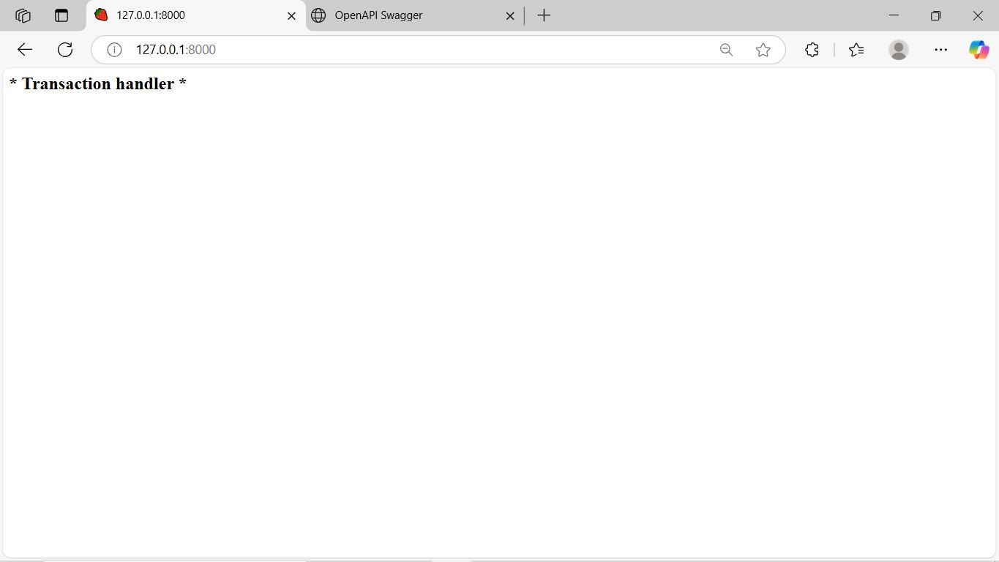
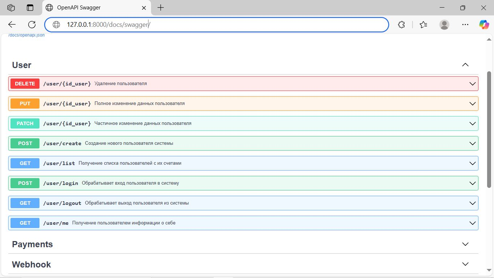
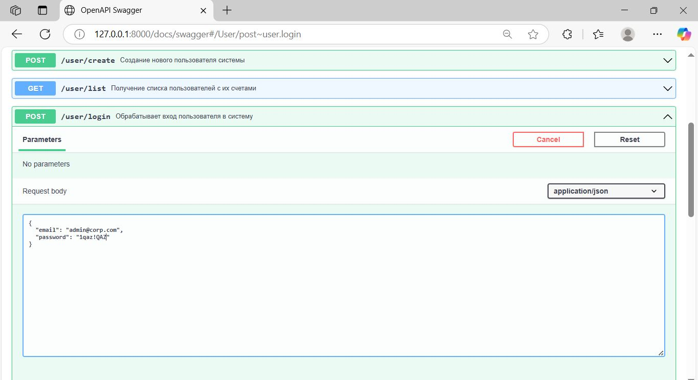
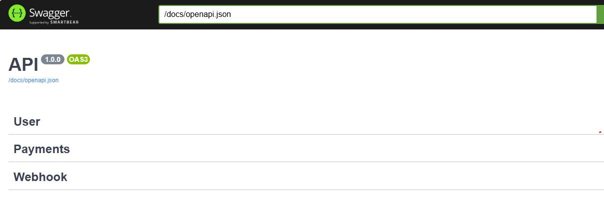
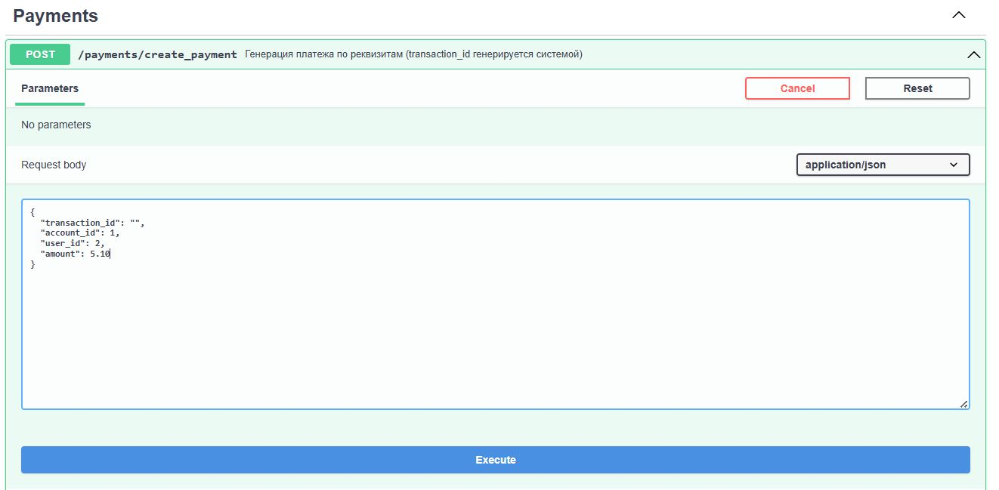
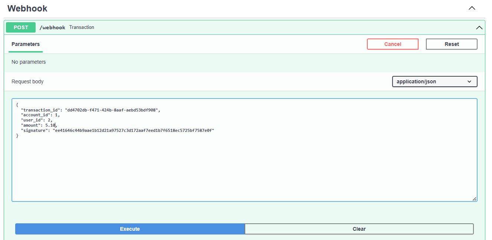

# API для обработки транзакций
### Реализация бэкенд сервиса для обработки webhook от сторонней платежной системы 

Используемые технологии:
- Фреймворк: Sanic
- База данных: PostgreSQL
- ORM: SQLAlchemy
- Аутентификация: JWT
- Управление миграциями: Alembic
- Тестирование: Pytest


Реализованный функционал:
- авторизация и аутентификация пользователей с использование JWT
- создание/редактирование пользователей администратором 
- получение администратором списка пользователей со списком счетов с балансами
- получение пользователем списка своих счетов
- получение пользователем списка своих платежей
- получение пользователем/администратором данных о себе
- обработка платежа

## Правила использования

Пользователи разделяются  на: администраторов и пользователей.

Администратор может создать/удалить/обновить пользователя, получить список пользователей с их счетами.
Пользователь может получить данные о себе, список своих счетов и балансов, список своих платежей.

## Запуск проекта

Для развертывания проекта используется `Docker Compose`.

Перед запуском проекта необходимо подготовить env-файл:

Чтобы запустить проект используем команду:
```
docker compose up -d
```

Для запуска приложения из командной строки (без docker compose)

```
sanic src.main:app --host=0.0.0.0 --port=8000 --fast
```

При первом запуске проекта необходимо выполнить миграции базы данных с помощью Alembic используя команду:

```
docker compose exec app alembic upgrade head
```
Миграция создаёт двух пользователей:

- администратора с email: admin@corp.com и паролем: 1qaz!QAZ
- пользователь с email: elene@corp.com и паролем: 2wsx@WSX (реквизиты счера: account_id=1, user_id=2)

Стартовая страница проекта [http://127.0.0.1:8000](http://127.0.0.1:8000).


Страница с интерактивной документацией [http://127.0.0.1:8000/docs/swagger](http://127.0.0.1:8000/docs/swagger).


Перед началом работы необходимо авторизоваться.



Затем можно начать работу с транзакциями. 

Для каждой задачи создан отдельный раздел:
- Users - управление пользователями
- Payments - получение информации о счетах и платежах
- Webhooks - обработка платежа



Для проверки работы сервиса с помощью эндпоинта `/payments/create_payment` создаём тестовую транзакцию
указав user_id пользователя, account_id счета пользователя, amount (сумму) транзакции. 



С помощью эндпоинта `/webhook` запускаем сформированную транзакцию, скопировав в тело запроса 
результат предыдущего запроса (необходимо отредактировать значение поля amount убрав ковычки)



## Тестирование проекта

Для тестирования проекта необходимо создать тестовую базу командой
```
docker compose -f docker-compose-test.yml up -d
```

Перейти в каталог с тестами
```
cd tests
```

Для тестирования раздела работы с пользователями
```
pytest -v test_user.py
```

Для тестирования раздела работы со счетами/платежами
```
pytest -v test_payments.py
```

Для тестирования раздела работы с транзакцией
```
pytest -v test_transaction.py
```

## Licence

Author: Stanislav Rubtsov